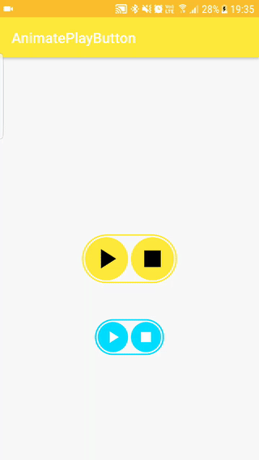

# AnimatePlayButton
play button animate to pause and stop button



## Import
Add it in your root build.gradle at the end of repositories:
```gradle
	allprojects {
		repositories {
			...
			maven { url "https://jitpack.io" }
		}
	}
```
Step 2. Add the dependency
```gradle
    dependencies {
        compile 'com.github.SwiftyWang:AnimatePlayButton:1.3'
	}
```


## How to use
Use it in xml
```xml
    <com.swifty.animateplaybutton.AnimatePlayButton
        android:layout_width="wrap_content"
        android:layout_height="wrap_content"
        app:ap_animation_duration="250"
        app:ap_border_color="@color/colorPrimary"
        app:ap_button_background="@drawable/circle_primary_bg"
        app:ap_button_color="@android:color/black"
        app:ap_button_size="60dp"/>

```
Add click listener in Java/Kotlin
```kotlin
        animatePlayButton.setPlayListener(object : AnimatePlayButton.OnButtonsListener {
            override fun onPlayClick(playButton: View): Boolean {
                return true
            }

            override fun onPauseClick(pause: View): Boolean {
                return true
            }

            override fun onResumeClick(pause: View): Boolean {
                return true
            }

            override fun onStopClick(stop: View): Boolean {
                return true
            }
        })
```

## Reference
| xml attribute         | description                                  | default value                   |
|-----------------------|----------------------------------------------|---------------------------------|
| ap_animation_duration | the transform animation duration             | 300(300ms)                      |
| ap_border_color       | the outside border color                     | @android:color/holo_blue_bright |
| ap_button_background  | the button's background(need shape drawable) | @drawable/circle_button_bg      |
| ap_button_color       | the button's icon color                      | @android:color/white            |
| ap_button_size        | the button's size                            | 42dp                            |
